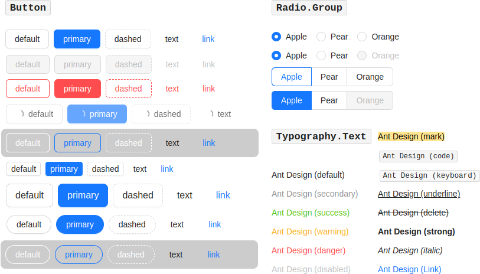

kotlin-antd
===========

Kotlin wrapper for **Ant Design** (React UI library `antd`, https://ant.design/docs/react/introduce)

<hr />

**LIVE DEMO**: https://tonycode.dev/demos/kotlin-antd-demo/

(this is deployed `demo` module from this repository)

<hr />




## Usage

**Work-In-Progress**: Initial release are not ready yet, but SNAPSHOT's are available

```kotlin
repositories {
    //...
    maven("https://s01.oss.sonatype.org/content/repositories/snapshots/")
}
```

```kotlin
implementation("dev.tonycode.kotlin-wrappers:kotlin-antd:0.1.0-SNAPSHOT") {
    isChanging = true  // instruct Gradle to check for SNAPSHOT updates
}
```

```kotlin
import antd.*


Space {
    direction = Direction.vertical
    size = Size.large

    Typography.Title {
        level = 3
        +"h3. Ant Design"
    }

    Typography.Text {
        code = true
        +"Ant Design (code)"
    }

    Button {
        type = ButtonType.primary
        danger = false
        disabled = false
        ghost = false
        loading = false
        shape = ButtonShape.round
        size = Size.large

        +"default"
    }

    Radio.Group {
        setOptions("Apple", "Pear", "Orange")
        value = "Apple"

        disabled = false
        optionType = RadioOptionType.button
        buttonStyle = RadioButtonStyle.outline
        size = Size.large

        onChange = { console.dir(it) }
    }

    Checkbox {
        checked = true

        onChange = {
            console.dir(it.target.checked)
        }

        +"Checkbox"
    }

    Select {
        options = arrayOf(
            Option("Item 1"),
            Option("Item 2"),
            Option("Item 3")
        )
        defaultValue = "Item 1"

        onChange = { console.log(it) }
    }
}
```

see usage examples here:

- [Button](demo/src/jsMain/kotlin/dev/tonycode/kotlin_wrappers/kotlin_antd_demo/ui/screens/button/ButtonDemo.kt)
- [Radio](demo/src/jsMain/kotlin/dev/tonycode/kotlin_wrappers/kotlin_antd_demo/ui/screens/radio/RadioDemo.kt)
- [Typography.Title](demo/src/jsMain/kotlin/dev/tonycode/kotlin_wrappers/kotlin_antd_demo/ui/screens/typography/TypographyTitleDemo.kt)
- [Typography.Text](demo/src/jsMain/kotlin/dev/tonycode/kotlin_wrappers/kotlin_antd_demo/ui/screens/typography/TypographyTextDemo.kt)


## Wrappers implemented

- General
    - `Button` (90%)
    - `Icon` (1%)
    - `Typography.Title` (70%)
    - `Typography.Text` (70%)
- Layout
    - `Space` (100%)
- Data Entry
    - `Checkbox` (95%)
    - `Radio.Button` (95%)
    - `Radio.Group` (95%)
    - `Select` (10%)
    - `Switch` (50%)
- Data Display
    - `Tabs` (10%)
- Feedback
    - `Spin` (95%)

Full list of `antd` js-library Components: https://ant.design/components/overview


## License

[MIT](LICENSE)
